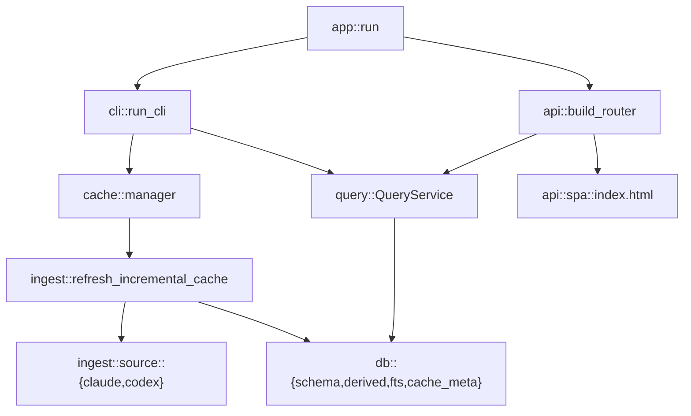

# ADR 0002: Modular Architecture for `mmr` (Decompose `src/main.rs`)

Date: 2026-02-23  
Status: Accepted

## Context

`mmr` had accumulated most runtime concerns in a single `src/main.rs` with 4,000+ lines, including:

- schema and migration logic;
- Claude/Codex parsing and ingestion;
- incremental checkpoint logic;
- cache lock/cooldown/snapshot orchestration;
- query SQL for CLI and API;
- API contract types/handlers/OpenAPI wiring;
- embedded SPA frontend;
- CLI argument parsing/dispatch.

This made ownership boundaries unclear, increased merge risk, and made behavior drift between CLI/API easy.

## Decision

Adopt a modular single-crate architecture with `src/lib.rs` and a thin binary entrypoint (`src/main.rs`),
with each functional area split into focused modules.

### Component breakdown

| Component | Responsibility | New module(s) |
|---|---|---|
| Database bootstrap/schema/FTS | DuckDB setup, schema lifecycle, FTS index lifecycle | `src/db/schema.rs`, `src/db/fts.rs` |
| Derived-table maintenance | Rebuild `sessions`/`projects`/`ingest_sessions` | `src/db/derived.rs` |
| Cache metadata | Cache schema version and refresh metadata writes | `src/db/cache_meta.rs` |
| Claude ingestion | Claude JSONL parsing and full ingest traversal | `src/ingest/source/claude.rs` |
| Codex ingestion | Codex JSONL parsing and full ingest traversal | `src/ingest/source/codex.rs` |
| Shared ingest helpers | Content/usage extraction, Claude path derivation, recursive JSONL scan | `src/ingest/source/common.rs` |
| Incremental checkpoint state | File state models, refresh decisions, state upserts | `src/ingest/incremental/state.rs` |
| Incremental processors | Offset-based parsing and per-file incremental processing | `src/ingest/incremental/processors.rs` |
| Incremental orchestrator | End-to-end incremental refresh pipeline | `src/ingest/incremental/refresh.rs` |
| Full ingest orchestrator | Full in-memory server ingest flow | `src/ingest/full.rs` |
| Ingest stats | Aggregate source/project/session/message counters | `src/ingest/stats.rs` |
| Query service | Shared read/query semantics for CLI and API | `src/query/service.rs`, `src/query/search.rs` |
| CLI cache runtime | Pathing, lock/cooldown, snapshot swap, worker execution | `src/cache/manager.rs` |
| CLI surface | Arguments, command dispatch, JSON output path | `src/cli/args.rs`, `src/cli/runner.rs` |
| API surface | DTOs/params/handlers/router/OpenAPI | `src/api/*.rs` |
| SPA UI asset | Embedded frontend HTML + fallback handler | `src/api/spa/index.html`, `src/api/spa/mod.rs` |
| App bootstrap | Top-level mode selection and server startup wiring | `src/app/run.rs` |

### Dependency rules



### Target structure

```text
src/
  main.rs
  lib.rs
  app/
    mod.rs
    run.rs
  domain/
    mod.rs
    source.rs
    pagination.rs
    models.rs
  db/
    mod.rs
    schema.rs
    fts.rs
    derived.rs
    cache_meta.rs
  ingest/
    mod.rs
    stats.rs
    full.rs
    source/
      mod.rs
      common.rs
      claude.rs
      codex.rs
    incremental/
      mod.rs
      state.rs
      processors.rs
      refresh.rs
  query/
    mod.rs
    service.rs
    search.rs
  cache/
    mod.rs
    manager.rs
  api/
    mod.rs
    state.rs
    params.rs
    dto.rs
    handlers.rs
    router.rs
    openapi.rs
    spa/
      mod.rs
      index.html
  cli/
    mod.rs
    args.rs
    runner.rs
tests/
  cli_cache.rs
  cli_benchmark.rs
  api_endpoints.rs
  encoding_rules.rs
```

## Consequences

Benefits:

- reduced cognitive load and clearer ownership by concern;
- shared query path between CLI and API reduces SQL drift;
- easier isolated testing of parser, cache, query, and API layers;
- `src/main.rs` is now a thin entrypoint.

Tradeoffs:

- larger module surface and more imports to manage;
- cross-module visibility must be carefully constrained (`pub` vs `pub(crate)`).

## Verification

The decomposition is validated by:

- `cargo check`
- `cargo fmt -- --check`
- `cargo clippy --all-targets --all-features -- -D warnings`
- `cargo test`
- `cargo test --test cli_benchmark -- --ignored`
